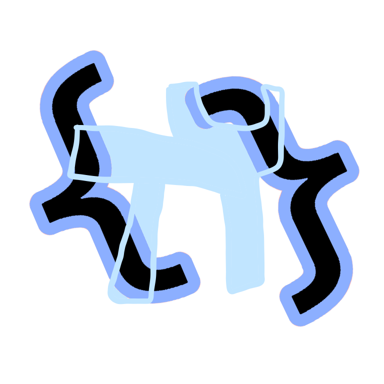

 

# Permafy Blockder
Create extensions for Permafy using block-based coding.

## In development
This project is not finished and is still being worked on. Expect bugs and problems that may prevent the site from working.
This project is also a fork of [JeremyGamer13/turbobuilder](https://github.com/JeremyGamer13/turbobuilder).

## Running locally

1. Clone the repo
2. Run `npm i --force` in a terminal inside the folder where the repo is
3. Run `npm run dev` in a terminal inside the folder where the repo is
4. Visit http://localhost:5173/
